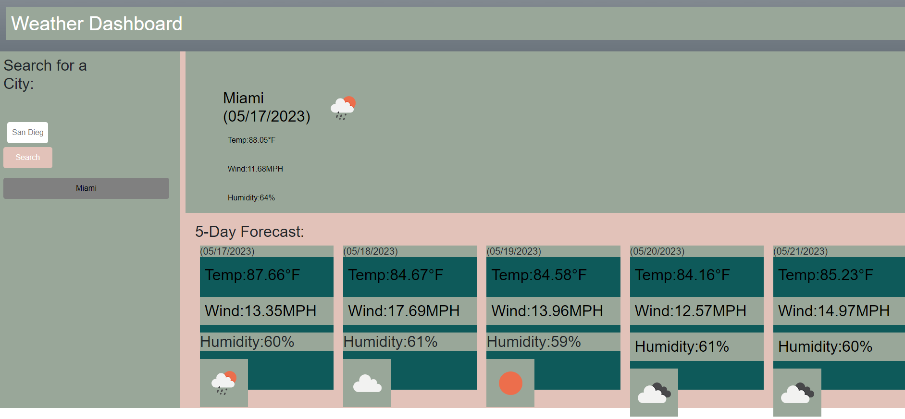

# Weather_Dashboar

## Description

The motivation behind this project was to create a user-friendly weather dashboard that would show the user a city's local weather and forecast. This project was built for users to look up their cities local weather and forecast while also searching for other cities and keeping their search history on the page. If the user is interested in comparing local weather they can use the weather dashboard to look up the weather of that city and click between their search history. This may be helpful for users planning a trip itinerary to visit multiple cities and want to take a look at the current and future forecast. While making this project I learned the use of server side APIs and the use of template literals to customize the data retrieved.
 

## Usage

To use the weather dashboard, click inside the text box and type the name of the city then click enter. The name of the city will appear with a button down below the search and can be clicked on to go back to that cities current weather and future forecast. 

[Work Day Scheduler Webpage](https://k-pineda.github.io/Work_Day_Scheduler/)

## Credits

[Challenge 6 Repo](https://github.com/k-pineda/Weather_Dashboard.git)

